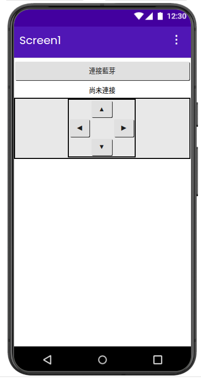
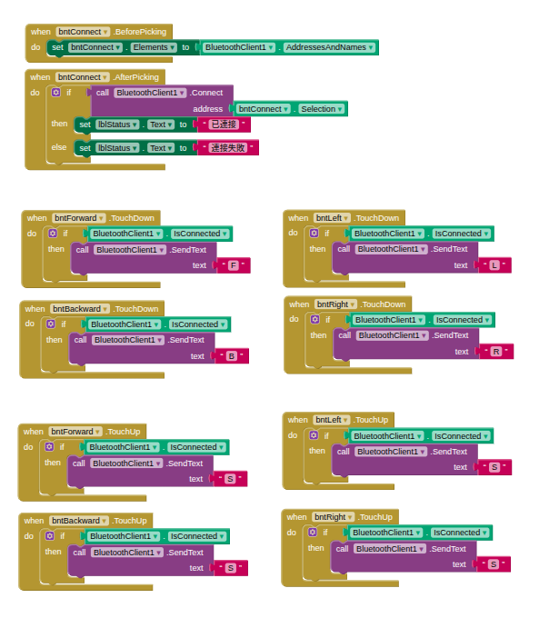
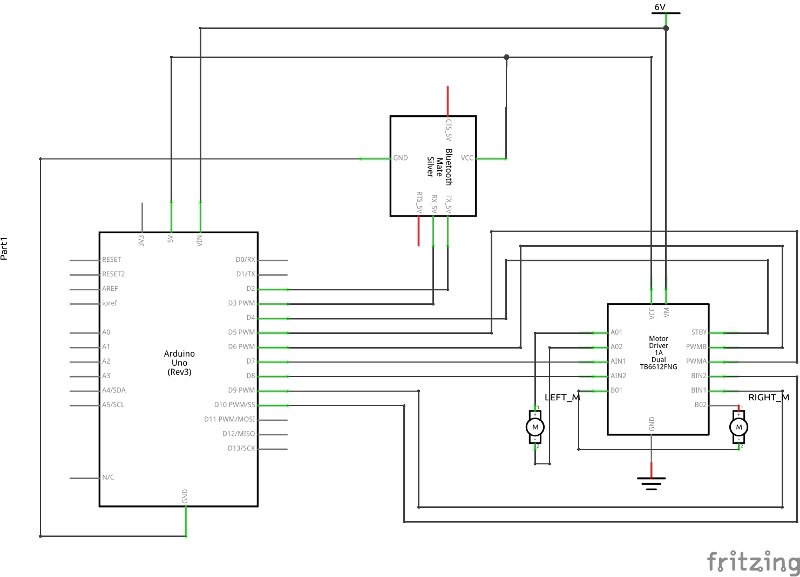

# 藍芽遙控車 — 學習歷程紀錄

**作者：** 桂馨雨（高二） 
**時間：** 2026 年暑假 
**主題：** 用 Arduino + 藍芽模組做一台手機可以遙控的雙輪驅動小車

  <video src="images/demo.mp4" controls width="520"></video> 
  成果展示——手機 App 四方向鍵即時控制小車前進、後退、左轉、右轉

   
  完成品——Arduino + TB6612FNG + HC-05，麵包板全部鎖固在車體上

---

## 動機

我從小就對機器人跟會動的東西很有興趣，之前用 Arduino 做過一些小實驗，但都是「板子插著不動」的類型。這個暑假想挑戰做一台真正「可以跑、可以用手機控制」的車，所以找了學工程的爸爸當顧問，一起把之前組好、馬達也測過的雙輪車體，改造成一台藍芽遙控車。

過程中，爸爸有用 Claude（一個 AI 程式助手）幫忙產生電路設計建議、腳位對照表跟 Arduino 程式範例；實際的接線、燒錄、上路測試，還有排查程式跑不動的問題，都是我自己動手做的。這份紀錄就是把整個過程、遇到的問題跟學到的東西寫下來。

## 專案目標

把整個專案拆成三個階段，一步一步驗證，而不是一次全部接好才測試：

| 階段 | 目標 |
|---|---|
| (a) | Arduino 分別控制兩顆馬達正轉、反轉，確認接線方向正確 |
| (b) | 讓車體做出前進、後退、原地左轉、原地右轉 |
| (c) | 接上藍芽模組，用手機 App（App Inventor 做）的四個方向鍵即時控制 |

## 使用材料

| 零件 | 數量 | 用途 |
|---|---|---|
| Arduino Uno | 1 | 主控板 |
| TB6612FNG 馬達驅動模組 | 1 | 放大電流、控制馬達方向與轉速 |
| HC-05 藍芽模組 | 1 | 讓手機透過藍芽序列埠跟 Arduino 溝通 |
| TT 馬達（含輪子） | 2 | 左右驅動輪 |
| 4×1.5V 電池盒（6V） | 1 | 系統唯一電源，同時供電給 Arduino 和馬達 |
| 麵包板、杜邦線 | 1 組 | 接線 |
| App Inventor | — | 設計手機端 App 介面（用拖拉積木寫程式，不用打傳統程式碼）|

**為什麼需要 TB6612FNG？** Arduino 的腳位本身電流很小，沒辦法直接驅動馬達，需要透過這顆驅動晶片放大電流，同時用 IN1/IN2 兩隻腳位的高低電位組合，決定馬達轉動的方向。

   
  剛拿到的所有零件

## 電路設計

先由 AI 協助畫出電路方塊圖跟完整的接腳對照表，再自己照著插到麵包板上。完整的電路設計頁面（含方塊圖、零件清單、接腳對照表、組裝順序）見 [`circuit-design.html`](./circuit-design.html)。主要接腳：

- Arduino `D5`/`D6`（PWM）→ TB6612 `PWMA`/`PWMB`：控制左右馬達轉速
- Arduino `D7`/`D8`、`D9`/`D10` → TB6612 `AIN1`/`AIN2`、`BIN1`/`BIN2`：控制左右馬達方向
- Arduino `D4` → TB6612 `STBY`：驅動晶片啟用腳，忘記接或沒拉 HIGH，馬達會完全不轉
- Arduino `D2`/`D3` → HC-05 `TXD`/`RXD`：軟體序列埠，讓 Arduino 收送藍芽資料
- 電池 6V 同時接到 Arduino `Vin` 跟 TB6612 `VM`，所有模組共地（GND 接在一起）

因為電池同時要供電給 Arduino 跟馬達，馬達啟動瞬間電流變化可能讓電壓下垂，這是設計電源時特別要注意、之後測試如果遇到「莫名重開機」要回頭檢查的地方。

   
  TB6612FNG 實際腳位標示

   
  HC-05 藍芽模組——車子就是透過這顆連上手機的

## 動手組裝

車體、輪子、馬達是暑假一開始就先組好的；電子零件（Arduino、麵包板、電池盒）則是後來才鑽孔鎖上去。

  
   
  左：馬達與輪胎鎖上底盤　右：底盤正面

   
  花了很大功夫才鑽了孔，把電池盒、麵包板還有 Arduino 鎖固上去

   
  所有線路接通了，準備開始 (a) 階段測試

## 學習歷程紀錄

### Step 1：Arduino 基本測試（LED 內建燈）
在正式接馬達之前，先確認 Arduino 板子本身、USB 燒錄流程都正常。用板子上 `D13` 內建的 LED（程式裡用 `LED_BUILTIN`）寫一個 0.5 秒閃一次的 blink 程式，上傳後 LED 正常一亮一滅，代表 Arduino 沒問題，之後如果出狀況就可以先排除「板子本身壞掉」這個可能。

### Step 2：(a) 馬達正反轉測試
先不接電池、不接馬達確認開機穩定後，才接上電池跟兩顆 TT 馬達，寫程式讓左馬達正轉 2 秒、反轉 2 秒，再換右馬達，並透過 Serial Monitor 印出目前在測哪顆馬達、哪個方向，方便對照實際看到的轉動方向。

第一次就兩顆馬達方向都正確，代表 TB6612 的接線（尤其是 `AIN1/AIN2`、`BIN1/BIN2` 方向控制）沒有接反。

### Step 3：(b) 前進 / 後退 / 左轉 / 右轉
把單顆馬達的控制包成 `moveForward()`、`moveBackward()`、`turnLeft()`、`turnRight()` 幾個函式，轉彎採用「原地轉」的方式：左轉時左輪反轉、右輪正轉，右轉相反。實際把車子放到地上測試，四個動作方向都正確。

### Step 4：(c) 藍芽連線與指令控制
接上 HC-05，先手動配對藍芽、再用手機上的 Bluetooth Serial 測試 App 送出 `F`（前進）等單一字元指令，Arduino 收到後控制對應的馬達動作。

**遇到的 bug：** 第一次測試時，敲了 `F` 之後馬達完全沒有動，Serial Monitor 還印出一堆看不懂的空白跟亂碼字元。後來跟爸爸一起分析才發現：手機的 Bluetooth Serial App 送出文字後，會額外多送一個「換行字元」，而原本的程式是「收到什麼字元就整個當作新指令」，所以實際發生的事情是：

1. 收到 `F` → 馬達準備開始轉
2. 幾乎同一瞬間又收到換行字元 → 因為看不懂，程式就當作「停止」指令

兩件事發生得太快，馬達根本來不及被觀察到有動。解法是在收到資料時先判斷「這個字元是不是我看得懂的指令（F/B/L/R/S）」，不是的話就直接忽略，不要更新目前的動作狀態。

這個 bug 讓我第一次實際體會到「序列通訊是一個一個位元組（byte）在傳」，跟我原本想像「整串文字一次送到」不一樣，也學到寫通訊程式時要對輸入資料做基本的檢查跟過濾，不能假設對方永遠只送我想要的東西。

**App Inventor 手機介面：** Arduino 端指令解析修好後，接著在 App Inventor 做出實際的手機介面：一個「連接藍芽」按鈕（用 `ListPicker` 列出已配對裝置、`BluetoothClient1.Connect` 連線）、一個顯示連線狀態的文字、還有排成十字形的四個方向鍵。

   
  Designer 畫面 — 十字形方向鍵

方向鍵的邏輯用 `TouchDown`／`TouchUp` 事件：手指按下時送出方向字元（`F`/`B`/`L`/`R`），放開時統一送 `S` 停止，這樣操作起來才會是「按著移動、放開就停」的直覺手感，而不是按一下衝一段距離。

   
  Blocks 邏輯 — 四個方向鍵的 TouchDown / TouchUp

寫 Blocks 積木的時候也踩了幾個小坑，例如一開始分不清楚「屬性（teal 色、沒有 call）」跟「方法（紫色、有 call）」的積木長什麼樣子，找 `BluetoothClient1.Connect` 找錯抽屜；也曾經抓不準怎麼把一塊積木拖進另一塊的凹槽裡。這些雖然都是小地方，但也是第一次接觸「積木式」寫程式的方式跟寫文字程式碼很不一樣的地方——邏輯結構要用「拼圖形狀對不對」去理解，而不是打字打對就好。

實際測試時，Arduino 燒好程式、手機跟 HC-05 配對、App 點「連接藍芽」顯示「已連接」後，按著四個方向鍵，車子前進、後退、左轉、右轉都正確，放開手指也確實停下來。**(c) 階段測試通過。**

一開始都是用 **MIT AI2 Companion** 這個 App 即時預覽測試，後來透過 App Inventor 的 `Build → App (provide QR code for .apk)` 把專案編譯成真正的 `.apk`，掃 QR code 下載安裝到手機上，變成一個獨立的 App（桌面上有自己的 icon，不用再開電腦、不用開 Companion，直接點開就能用）。安裝時手機會跳出「不明來源」的警告，因為不是從 Google Play 商店下載的，允許安裝來源後就能裝了。

原本規劃還有一個 (d) 階段，想做「按住加速、放開減速」的漸進速度控制。後來評估目前 (a)(b)(c) 已經把最初「手機藍芽遙控車」的目標完整做出來、原理也都搞懂了，決定把 (d) 收起來，不繼續往下做，把這個階段的成果當作這次專題的最終版本。

### 延伸學習：用 Fritzing 畫正式電路圖

功能都做完之後，想把電路圖用比較正式的方式留下紀錄，而不是只有手繪或截圖，所以另外找時間學了 **Fritzing**——一套開源的電路圖繪製軟體，很多 Maker 專案的電路圖都是用它畫的。摸索了一下怎麼放元件、怎麼牽線、怎麼標示電源軌之後，畫出了下面這張完整的電路圖。

   
  用 Fritzing 畫的電路圖（藍芽模組用軟體內建的 Bluetooth Mate 元件代替實際使用的 HC-05，接線方式相同）

## 目前進度

- [x] (a) 馬達正反轉測試
- [x] (b) 前進 / 後退 / 左轉 / 右轉
- [x] (c) 電路接線、Arduino 端指令解析、App Inventor 手機 App 四方向鍵，實測通過

## 專案檔案

| 檔案 | 對應階段 | 說明 |
|---|---|---|
| [`circuit-design.html`](./circuit-design.html) | — | 電路設計頁面：方塊圖、零件清單、接腳對照表、組裝順序 |
| `motor_test_a/motor_test_a.ino` | (a) | 兩顆馬達分別正轉、反轉測試 |
| `motor_test_b/motor_test_b.ino` | (b) | 前進、後退、原地左轉、原地右轉測試 |
| `bt_car_control/bt_car_control.ino` | (c) | 接收藍芽指令並控制馬達 |
| [`app_inventor/BTCarControl.aia`](./app_inventor/BTCarControl.aia) | (c) | App Inventor 專案原始檔（可重新匯入編輯） |
| [`app_inventor/BTCarControl.apk`](./app_inventor/BTCarControl.apk) | (c) | 編譯好的安裝檔，可直接裝到 Android 手機上獨立執行 |
| `app_inventor/design.png`、`app_inventor/block.png` | (c) | Designer 畫面與 Blocks 邏輯截圖 |
| [`images/schem.png`](./images/schem.png) | — | 用 Fritzing 畫的正式電路圖 |
| [`images/demo.mp4`](./images/demo.mp4) | (c) | 手機 App 遙控小車的實際操作展示影片 |

## 心得反思

這個專案讓我第一次把「電路設計 → 寫程式 → 實際測試 → 出問題排查 → 修正」這個完整的循環走過一遍，跟以前照著教學文一步一步抄不一樣。印象最深的是藍芽指令那個 bug，一開始看到馬達不動、螢幕跳出亂碼會很挫折，但照著「先確認 Arduino 收到了什麼、再一步一步縮小範圍」的方式去查，其實每個問題背後都有很合理的原因。也很謝謝爸爸這次用比較「引導」而不是「直接給答案」的方式帶我做，讓我自己動手接線、動手測試、自己觀察馬達轉的方向對不對，感覺學到的東西比單純照抄程式碼扎實很多。
